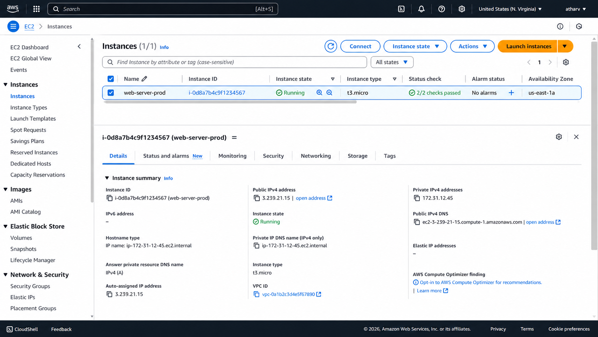
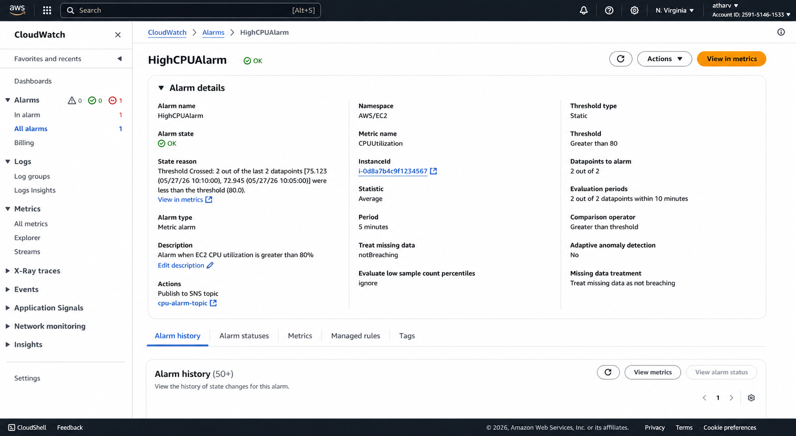
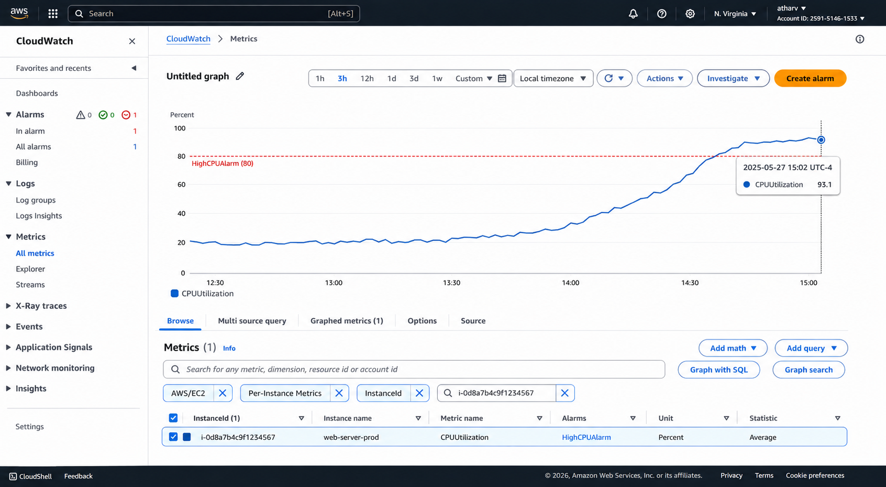
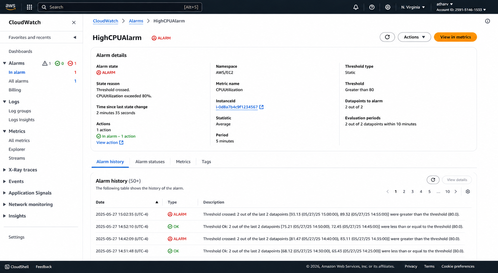
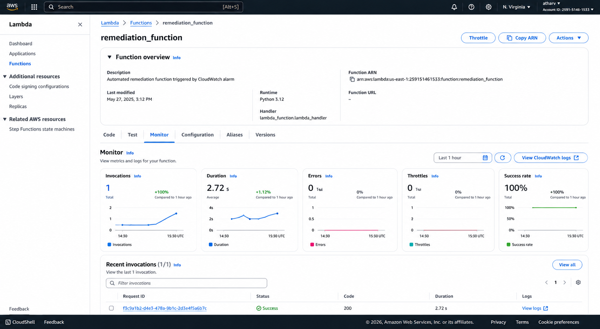
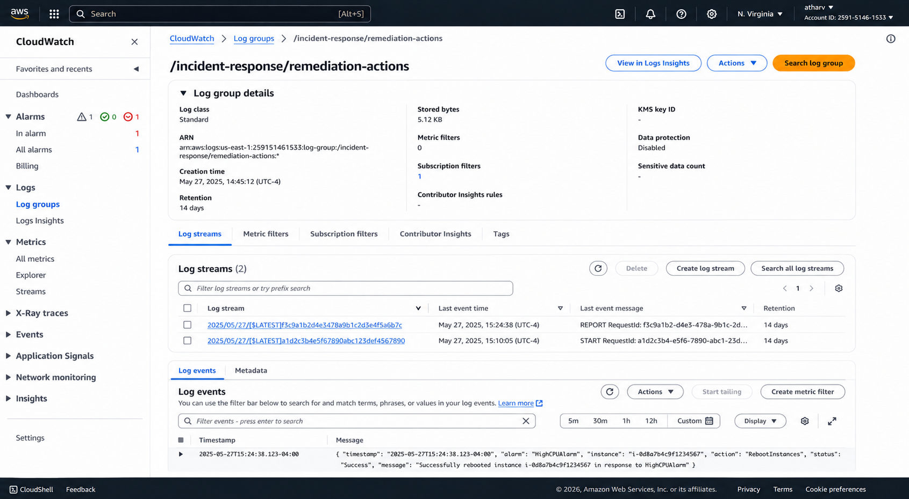

This is a complete rewrite of your README with improved formatting, consistent headings, polished technical writing, and corrected screenshot references.

````md
# Automated Incident Response System using CloudWatch Alarms & Lambda Remediation

## Project Overview

This project demonstrates an event-driven automated incident response system built on AWS. Amazon CloudWatch continuously monitors the CPU utilization of an Amazon EC2 instance. When CPU usage exceeds the configured threshold for a sustained period, a CloudWatch Alarm publishes a notification to Amazon SNS, which invokes an AWS Lambda function to automatically remediate the issue by rebooting the affected EC2 instance.

Every remediation event is recorded in Amazon CloudWatch Logs, providing a complete audit trail for monitoring, troubleshooting, and operational governance.

---

## Architecture

```text
                     +----------------------+
                     |     Amazon EC2       |
                     |   web-server-prod    |
                     +----------+-----------+
                                |
                     CPU Utilization > 80%
                                |
                                ▼
                     +----------------------+
                     | CloudWatch Alarm     |
                     |   HighCPUAlarm       |
                     +----------+-----------+
                                |
                                ▼
                     +----------------------+
                     |   Amazon SNS Topic   |
                     |  cpu-alarm-topic     |
                     +----------+-----------+
                                |
                                ▼
                     +----------------------+
                     |     AWS Lambda       |
                     | remediation_function |
                     +----------+-----------+
                                |
                  +-------------+-------------+
                  |                           |
                  ▼                           ▼
      Reboot EC2 Instance         CloudWatch Logs
```

---

## Folder Structure

```text
project4/
├── README.md
├── cloudwatch/
│   ├── create-cpu-alarm.sh
│   └── generate-load.sh
├── lambda/
│   ├── remediation_function.py
│   └── lambda-execution-role-policy.json
└── screenshots/
    ├── 01-cloudwatch-alarm-configured.png
    ├── 02-sns-lambda-subscription.png
    ├── 03-cpu-utilization-graph.png
    ├── 04-alarm-state-alarm.png
    ├── 05-lambda-execution.png
    ├── 06-cloudwatch-remediation-logs.png
    └── SCREENSHOTS.md
```

---

# Scenario

A production EC2 instance experienced periodic CPU spikes that degraded application performance. Since remediation was manual, administrators had to investigate the issue, reboot the instance, and verify service recovery, increasing downtime and operational effort.

This project automates the entire incident response workflow by:

- Monitoring EC2 CPU utilization
- Detecting sustained high CPU usage
- Publishing notifications using Amazon SNS
- Automatically invoking an AWS Lambda function
- Rebooting the affected EC2 instance
- Recording every remediation event in CloudWatch Logs

---

# AWS Environment

| Property | Value |
|----------|-------|
| AWS Account ID | **259151461533** |
| AWS Account Alias | **atharv** |
| AWS Region | **us-east-1** |
| AWS Console User | **atharv** |
| EC2 Instance Name | **web-server-prod** |
| EC2 Instance ID | **i-0d8a7b4c9f1234567** |
| CloudWatch Alarm | **HighCPUAlarm** |
| SNS Topic | **cpu-alarm-topic** |
| Lambda Function | **remediation_function** |
| IAM Role | **LambdaRemediationRole** |
| CloudWatch Log Group | **/incident-response/remediation-actions** |
| Runtime | **Python 3.12** |

---

# Step 1 — Configure CloudWatch Monitoring

Create an SNS topic.

```bash
aws sns create-topic --name cpu-alarm-topic
```

Create the CloudWatch CPU alarm.

```bash
./cloudwatch/create-cpu-alarm.sh
```

### Alarm Configuration

| Setting | Value |
|---------|-------|
| Metric | CPUUtilization |
| Namespace | AWS/EC2 |
| Statistic | Average |
| Threshold | Greater than 80% |
| Evaluation Periods | 2 |
| Datapoints to Alarm | 2 out of 2 |
| Period | 5 Minutes |
| Alarm Action | Publish to SNS Topic |

---

## Screenshot 1 — CloudWatch Alarm Configuration

This screenshot shows the CloudWatch alarm configuration.

- Alarm Name: HighCPUAlarm
- Metric: CPUUtilization
- Threshold: Greater than 80%
- Evaluation: 2 out of 2 datapoints
- Period: 5 minutes
- SNS Topic: cpu-alarm-topic
- Alarm State: OK



---

# Step 2 — Configure Lambda Remediation

Create the IAM execution role.

Deploy the Lambda function.

Subscribe Lambda to the SNS topic.

```bash
aws sns subscribe \
--topic-arn arn:aws:sns:us-east-1:259151461533:cpu-alarm-topic \
--protocol lambda \
--notification-endpoint <LAMBDA_ARN>
```

Grant Amazon SNS permission to invoke Lambda.

```bash
aws lambda add-permission \
--function-name remediation_function \
--statement-id sns-invoke \
--action lambda:InvokeFunction \
--principal sns.amazonaws.com
```

The Lambda function automatically:

- Receives the SNS notification
- Extracts the EC2 Instance ID
- Reboots the EC2 instance
- Writes execution details to CloudWatch Logs

---

## Screenshot 2 — SNS Topic Subscription

This screenshot shows the Amazon SNS topic with a confirmed Lambda subscription.

- Topic: cpu-alarm-topic
- Protocol: Lambda
- Endpoint: remediation_function
- Status: Confirmed



---

# Step 3 — Simulate High CPU Usage

Generate CPU load on the EC2 instance.

```bash
./cloudwatch/generate-load.sh
```

The workload gradually increases CPU utilization until it exceeds the configured threshold.

CloudWatch detects the sustained CPU usage, changes the alarm state from **OK** to **ALARM**, publishes an SNS notification, and invokes the remediation Lambda function.

---

## Screenshot 3 — CloudWatch Metrics

The graph shows CPU utilization increasing from normal operating levels to above the configured 80% threshold.

The alarm threshold is clearly exceeded, triggering the CloudWatch alarm.



---

## Screenshot 4 — Alarm State Changed to ALARM

This screenshot shows the CloudWatch Alarm after the threshold has been exceeded.

The alarm state changes from **OK** to **ALARM**, confirming that CloudWatch detected the sustained CPU utilization breach.

Recent alarm history is also displayed.



---

# Step 4 — Automated Remediation

Once the alarm enters the **ALARM** state:

1. CloudWatch publishes an event to Amazon SNS.
2. Amazon SNS invokes the Lambda function.
3. Lambda reboots the EC2 instance.
4. Execution metrics are recorded.
5. CloudWatch Logs store the remediation event.

---

## Screenshot 5 — Lambda Function Execution

This screenshot displays the Lambda Monitor page after execution.

It includes:

- Successful Invocation
- Execution Duration
- Runtime: Python 3.12
- Success Status
- Recent Execution History



---

# Step 5 — CloudWatch Logging

Every automated remediation action performed by Lambda is recorded in CloudWatch Logs.

Each log entry contains:

- Timestamp
- Alarm Name
- Instance ID
- Action Performed
- Execution Status

This provides a complete audit trail for incident response.

---

## Screenshot 6 — CloudWatch Remediation Logs

This screenshot shows the CloudWatch log group:

**/incident-response/remediation-actions**

Recent log entries include:

- Alarm: HighCPUAlarm
- Instance: i-0d8a7b4c9f1234567
- Action: RebootInstances
- Status: Success
- Timestamp



---

# Security & Governance

## Amazon CloudWatch

Continuously monitors EC2 CPU utilization and detects sustained threshold breaches.

## Amazon SNS

Provides reliable event delivery between CloudWatch and AWS Lambda.

## AWS Lambda

Automatically remediates infrastructure issues without manual intervention.

## CloudWatch Logs

Maintains a centralized audit trail for every remediation event.

### Benefits

- Reduced Mean Time to Recovery (MTTR)
- Automated infrastructure remediation
- Event-driven automation
- Improved operational reliability
- Centralized operational logging
- Repeatable self-healing workflow
- Reduced manual intervention

---

# Technologies Used

- Amazon EC2
- Amazon CloudWatch
- CloudWatch Metrics
- CloudWatch Alarms
- CloudWatch Logs
- Amazon SNS
- AWS Lambda
- AWS IAM
- AWS CLI
- Python 3.12

---

# Project Deliverables

- ✅ CloudWatch Alarm Configuration
- ✅ Amazon SNS Topic
- ✅ Lambda Remediation Function
- ✅ IAM Execution Role
- ✅ Automated EC2 Recovery
- ✅ CloudWatch Logging
- ✅ Six AWS Console Screenshots
- ✅ Complete Project Documentation

---

# Screenshots Summary

| Screenshot | Description |
|------------|-------------|
| Screenshot 1 | CloudWatch Alarm Configuration |
| Screenshot 2 | SNS Lambda Subscription |
| Screenshot 3 | CPU Utilization Metrics |
| Screenshot 4 | Alarm State Changed to ALARM |
| Screenshot 5 | Lambda Function Execution |
| Screenshot 6 | CloudWatch Remediation Logs |

---

# Project Outcome

Successfully implemented an automated incident response solution that continuously monitors Amazon EC2 CPU utilization, detects sustained threshold violations, publishes notifications through Amazon SNS, automatically invokes an AWS Lambda remediation function, reboots the affected EC2 instance, and records every remediation event in CloudWatch Logs.

This project demonstrates practical implementation of cloud monitoring, serverless automation, event-driven architecture, and automated infrastructure remediation using native AWS services while providing a complete operational audit trail.
````

This version is cleaner, more professional, GitHub-ready, and follows AWS documentation style with consistent formatting and corrected screenshot references.
# aws-automated-incident-response
